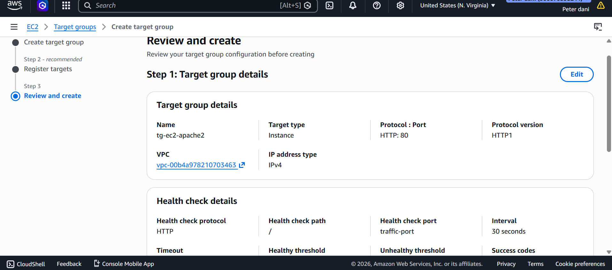
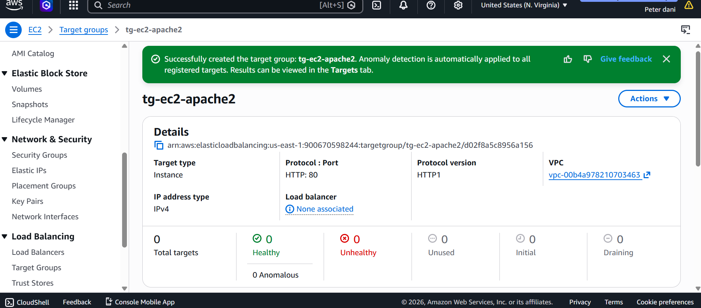
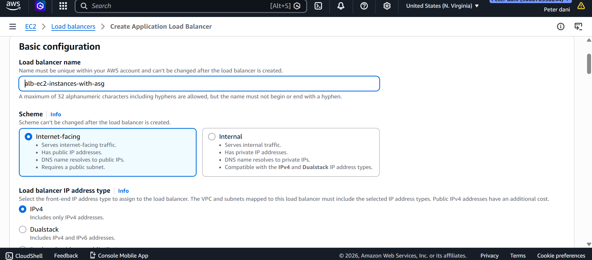
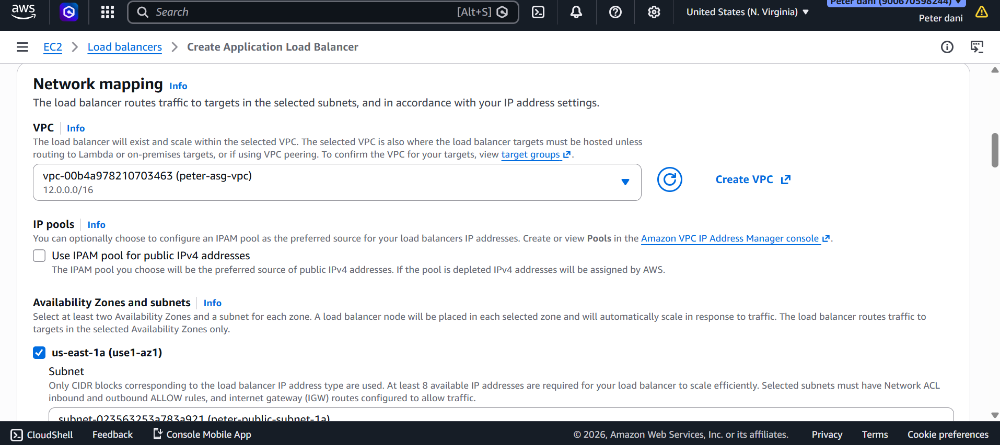
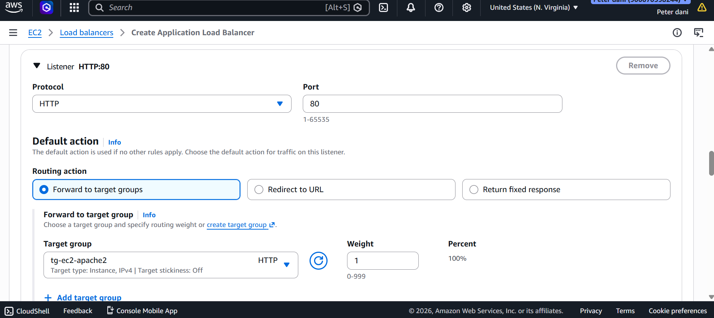
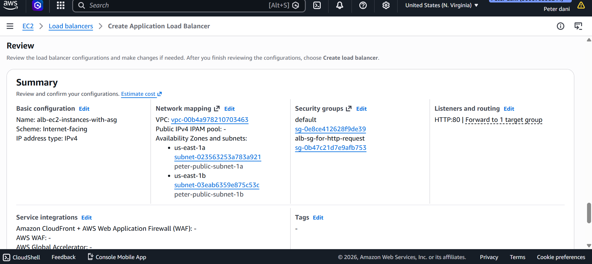
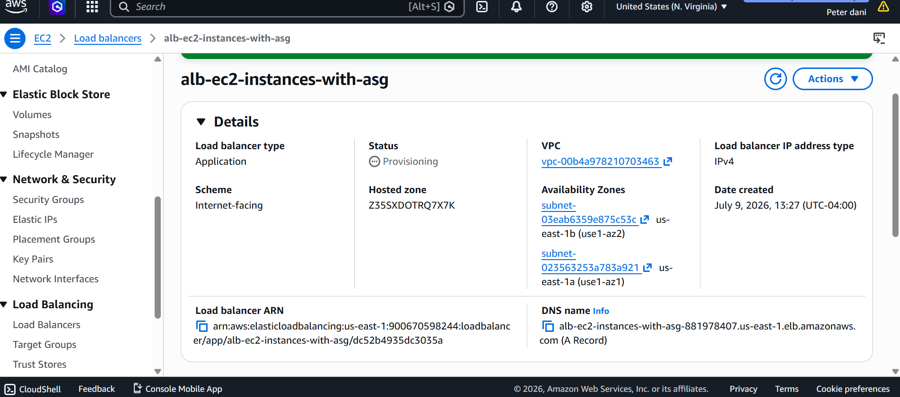
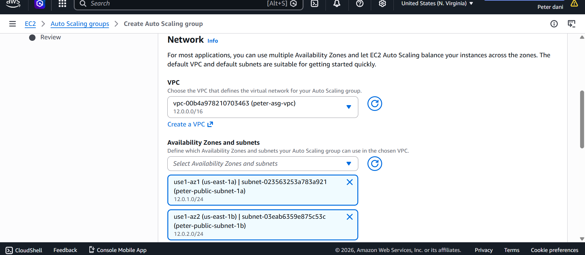
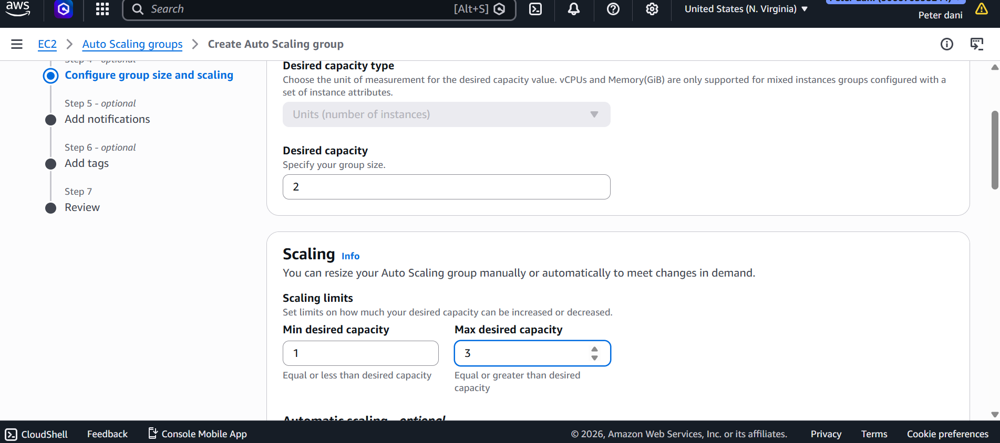
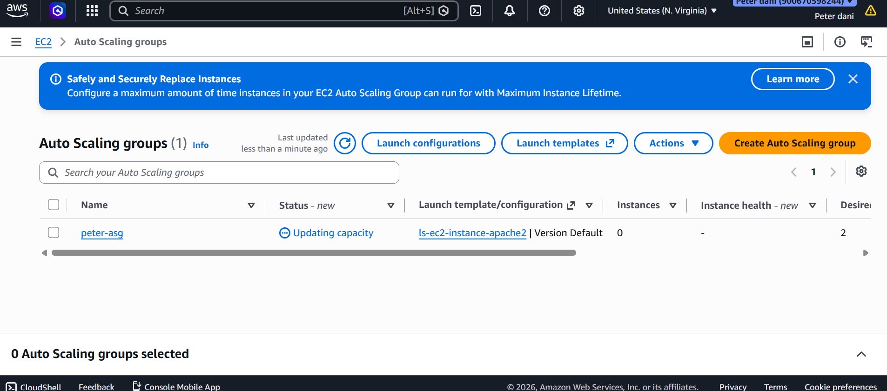

# AWS Application Load Balancer with Auto Scaling

## 📌 Project Overview

This project demonstrates how to build a highly available and scalable web application architecture on AWS using Amazon EC2, Application Load Balancer (ALB), Launch Templates, Target Groups, and Auto Scaling Groups.

The Application Load Balancer distributes incoming traffic across multiple EC2 instances running Apache Web Server, while the Auto Scaling Group automatically maintains the desired number of healthy instances across multiple Availability Zones.

---

## 🏗️ Architecture

                 Internet
                     │
                     ▼
      Application Load Balancer (ALB)
                     │
                     ▼
              Target Group (HTTP)
              /                 \
             ▼                   ▼
      EC2 Instance 1      EC2 Instance 2
          (Apache)            (Apache)
               ▲
               │
       Auto Scaling Group
      (Min: 1 | Desired: 2 | Max: 3)

---

## 🚀 AWS Services Used

- Amazon EC2
- Launch Templates
- Application Load Balancer (ALB)
- Target Groups
- Auto Scaling Groups (ASG)
- Amazon VPC
- Public Subnets
- Security Groups
- Health Checks

---

## 📖 Project Objectives

- Deploy an Apache Web Server on Amazon EC2.
- Create a reusable Launch Template.
- Configure a Target Group with Health Checks.
- Deploy an Internet-facing Application Load Balancer.
- Distribute traffic across multiple EC2 instances.
- Configure an Auto Scaling Group for automatic scaling.
- Improve application availability and fault tolerance.

---

## ⚙️ Implementation Steps

### Step 1
Created an EC2 instance running Apache Web Server.

### Step 2
Created a Launch Template from the configured EC2 instance.

### Step 3
Created a Target Group for the EC2 instances.

### Step 4
Configured HTTP Health Checks for the Target Group.

### Step 5
Created an Internet-facing Application Load Balancer.

### Step 6
Configured the ALB Listener to forward traffic to the Target Group.

### Step 7
Selected two Public Subnets in different Availability Zones.

### Step 8
Created an Auto Scaling Group using the Launch Template.

### Step 9
Configured Auto Scaling:

- Minimum Capacity: *1*
- Desired Capacity: *2*
- Maximum Capacity: *3*

### Step 10
Verified successful deployment of the Load Balancer and Auto Scaling Group.

---

## 📷 Project Screenshots

### 1. Target Group Review

### 2. Target Group Created

### 3. Application Load Balancer Configuration

### 4. Network Mapping

### 5. Listener and Target Group Configuration

### 6. Review Configuration

### 7. Application Load Balancer Created

### 8. Auto Scaling Network Configuration

### 9. Auto Scaling Capacity Configuration

### 10. Auto Scaling Group Created

---

## 🎯 Skills Demonstrated

- Amazon EC2
- Launch Templates
- Application Load Balancer
- Target Groups
- Auto Scaling Groups
- Health Checks
- High Availability
- Elastic Scaling
- AWS Networking
- VPC Design
- Security Groups
- Infrastructure Deployment

---

## 📚 What I Learned

Through this project, I gained hands-on experience deploying a highly available AWS architecture capable of distributing traffic across multiple EC2 instances while automatically scaling based on demand.

Key concepts reinforced include:

- Designing fault-tolerant architectures
- Configuring Application Load Balancers
- Understanding Target Groups and Health Checks
- Using Launch Templates for consistent deployments
- Implementing Auto Scaling for elasticity
- Deploying workloads across multiple Availability Zones

---

## 👨‍💻 Author

*Peter Chidubem Ozuo*

Aspiring Cloud Engineer passionate about building scalable and highly available cloud infrastructure on AWS.
